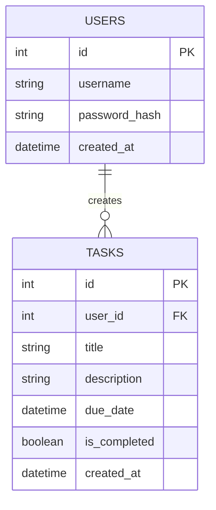

# 資料庫設計 (Database Design)

根據系統架構與 PRD，本專案使用 SQLite 作為關聯式資料庫。
系統中主要包含兩個核心實體：**使用者 (User)** 與 **任務 (Task)**。

## 1. 實體關聯圖 (ER Diagram)

## 2. 資料表說明

### `users` (使用者表)
儲存使用者的帳號資訊，用於登入與身份驗證。
| 欄位名稱 | 型別 | 屬性 | 說明 |
| -------- | ---- | ---- | ---- |
| `id` | INTEGER | Primary Key, Auto Increment | 使用者唯一識別碼 |
| `username` | TEXT | Unique, Not Null | 登入帳號名稱 |
| `password_hash`| TEXT | Not Null | 加密後的使用者密碼 |
| `created_at` | DATETIME | Default: CURRENT_TIMESTAMP| 帳號建立時間 |

### `tasks` (任務表)
儲存使用者的待辦事項，並透過 `user_id` 關聯到所屬的使用者。
| 欄位名稱 | 型別 | 屬性 | 說明 |
| -------- | ---- | ---- | ---- |
| `id` | INTEGER | Primary Key, Auto Increment | 任務唯一識別碼 |
| `user_id` | INTEGER | Foreign Key, Not Null | 建立此任務的使用者 ID |
| `title` | TEXT | Not Null | 任務標題 |
| `description`| TEXT | Nullable | 任務詳細描述 |
| `due_date` | DATE | Nullable | 任務截止日期 |
| `is_completed`| BOOLEAN | Default: 0 (False) | 標記是否已完成 |
| `created_at` | DATETIME | Default: CURRENT_TIMESTAMP| 任務建立時間 |
