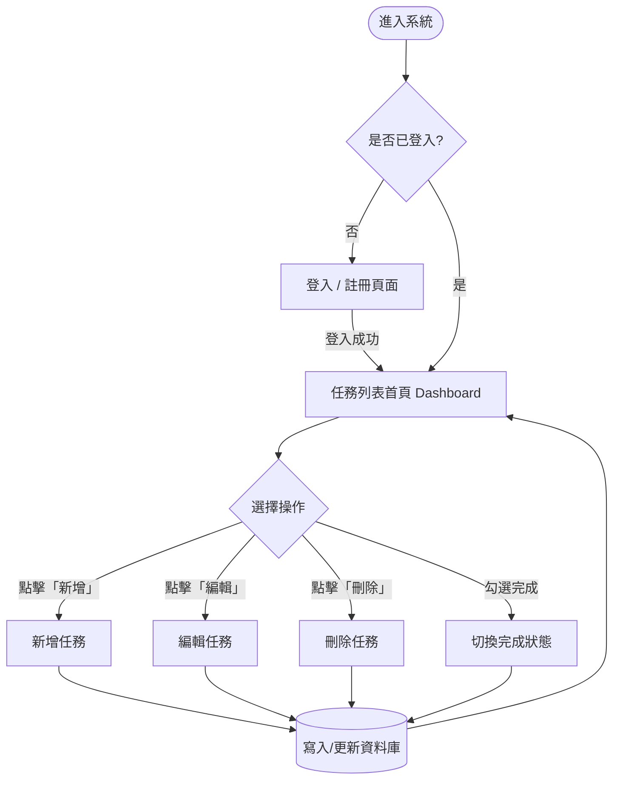

# 流程圖設計 (Flowchart)

根據 `docs/PRD.md` 與 `docs/ARCHITECTURE.md`，以下是「任務管理系統」的使用者操作流程圖。您可以在 VS Code 中安裝 Mermaid Preview 擴充功能，或是將以下語法貼到 GitHub 或 [Mermaid Live Editor](https://mermaid.live/) 中查看圖表。

## 使用者操作流程

## 流程說明
1. **進入系統**：使用者存取網站首頁。
2. **驗證身份**：系統檢查 Session 確認使用者是否已登入，若無則導向登入/註冊頁面。
3. **任務列表首頁**：登入成功後，使用者會看到自己建立的所有任務。
4. **選擇操作**：
   - **新增任務**：填寫任務名稱、截止日期並提交。
   - **編輯任務**：修改現有的任務內容。
   - **刪除任務**：將不需要的任務從系統移除。
   - **切換完成狀態**：將任務標記為已完成或未完成。
5. **資料庫更新**：任何操作都會更新到 SQLite 資料庫中，更新完成後畫面會重新導向回任務列表首頁，顯示最新狀態。
